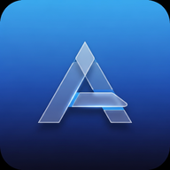

<div align="center">
  

  # AveGram

  **A modern, minimalist Telegram client for Android — refined glass UI, deep dark mode, and a curated set of power-user features.**

  [](#requirements)
  [](LICENSE)
  [](.github/workflows)
  [](https://github.com/Keeperorowner/NagramXF)

  [Features](#-features) · [Build](#-build) · [Documentation](docs/) · [Credits](#-credits--thanks) · [License](#-license)
</div>

---

## ✨ Features

| Category | Highlights |
|---|---|
| **Design** | Frosted-glass cards · 16–24 dp rounded corners · clean spacious layouts |
| **Theming** | True dark `#0D1117` background · glass accent surfaces · Material You support |
| **Privacy** | Ghost Mode (read without seen) · stealth typing · message log control |
| **Messaging** | Save & view deleted messages · full edit history · double-tap actions · bookmarks |
| **AI** | In-chat translation via OpenAI / Gemini / DeepSeek · system AI service helper |
| **Power tools** | Custom folders · per-chat settings · sticker set helpers · cache control |
| **Heritage** | All the goodies from NagramXF, AyuGram, Cherrygram, and exteraGram, refined |

> A more detailed feature breakdown lives in [`docs/FEATURES.md`](docs/FEATURES.md).

---

## 📱 Requirements

- Android **5.0 (Lollipop)** or newer
- ~150 MB free storage
- (Optional) A Telegram account

---

## 📦 Build

### Option A — GitHub Actions (recommended)

1. Fork this repository.
2. Open the **Actions** tab.
3. Run the **AveGram Release Build** workflow.
4. Download the signed APK from the workflow artifacts.

See [`docs/BUILD.md`](docs/BUILD.md) for environment variables, signing, and troubleshooting.

### Option B — Local build

```bash
git clone https://github.com/YOUR_USERNAME/AveGram
cd AveGram
echo "sdk.dir=$ANDROID_HOME" >> local.properties
./gradlew TMessagesProj:assembleRelease
```

Requires JDK 21, Android SDK with NDK `27.2.12479018`, and CMake. Full setup guide in [`docs/BUILD.md`](docs/BUILD.md).

---

## 🎨 Design System

| Token | Value | Usage |
|---|---|---|
| Primary | `#2196F3` | Buttons, accents, links |
| Primary Dark | `#1565C0` | Pressed / hover states |
| Background Light | `#FAFCFF` | Light theme background |
| Background Dark | `#0D1117` | Dark theme background |
| Card Dark | `#1C2232` | Glass surfaces in dark mode |
| Corner Radius | `16–24 dp` | Cards, sheets, dialogs |

Full design tokens, typography, and motion specs in [`docs/DESIGN_SYSTEM.md`](docs/DESIGN_SYSTEM.md).

---

## 📚 Documentation

| Document | What's inside |
|---|---|
| [`docs/BUILD.md`](docs/BUILD.md) | Toolchain, signing, build flavors, CI |
| [`docs/FEATURES.md`](docs/FEATURES.md) | Detailed feature catalog |
| [`docs/ARCHITECTURE.md`](docs/ARCHITECTURE.md) | Module layout & package structure |
| [`docs/DESIGN_SYSTEM.md`](docs/DESIGN_SYSTEM.md) | Colors, typography, components |
| [`docs/CONTRIBUTING.md`](docs/CONTRIBUTING.md) | How to contribute, code style, PRs |
| [`docs/CHANGELOG.md`](docs/CHANGELOG.md) | Release history |
| [`docs/CREDITS.md`](docs/CREDITS.md) | Upstream projects & acknowledgements |
| [`docs/PRIVACY.md`](docs/PRIVACY.md) | Data handling & third-party services |
| [`docs/SECURITY.md`](docs/SECURITY.md) | How to report vulnerabilities |

---

## 🙏 Credits & Thanks

AveGram stands on the shoulders of giants. Heartfelt thanks to:

- **[Telegram for Android](https://github.com/DrKLO/Telegram)** — the original client by Telegram FZ-LLC
- **[NagramXF](https://github.com/Keeperorowner/NagramXF)** — direct upstream fork
- **[NagramX](https://github.com/risin42/NagramX)** — power-user features & polish
- **[AyuGram](https://github.com/AyuGram/AyuGram4A)** — privacy & message-log innovations
- **[Cherrygram](https://github.com/arsLan4k1390/Cherrygram)** — UI refinements
- **[exteraGram](https://github.com/exteraSquad/exteraGram)** — design inspiration & components

Every line of code that survives from these projects keeps its original authorship and license.
A long-form thank-you note lives in [`docs/CREDITS.md`](docs/CREDITS.md).

---

## 📜 License

AveGram is licensed under the **GNU General Public License v3.0**.
You are free to use, modify, and redistribute under the same license.

```
Copyright (C) 2026  AveGram contributors

This program is free software: you can redistribute it and/or modify
it under the terms of the GNU General Public License as published by
the Free Software Foundation, either version 3 of the License, or
(at your option) any later version.
```

Full text: [`LICENSE`](LICENSE)

---

<div align="center">
  <sub>Made with ❤️ for the Telegram community.</sub>
</div>
